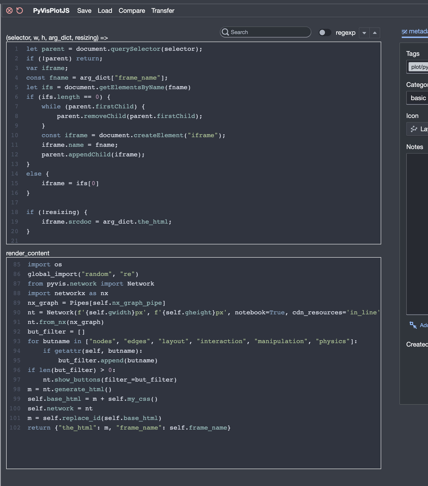

Javascript Tiles
================

You can build tiles that include custom javascript. To create one, go to your Library and select
:menuselection:`New --> Javascript Tile`. When editing a tile in the creator, you'll see something like this.
The top-left pane is where you'll write your javascript code.

In a javascript tile, your ``render_content`` method should return a dictionary, which will be passed to your
javascript code.

Your javascript code is passed four arguments: ``selector``, ``w``, ``h``, ``arg_dict``, and ``resizing``.
``selector`` is a string that gives access to the html element where the content of the tile
should be placed. ``w`` and ``h`` are the width and height of the area
to be drawn into. ``arg_dict`` is the dictionary of arguments returned by
``render_content``. ``resizing`` will be true if the tile is being resized by the user; it will be false otherwise.

If ``arg_dict`` contains a key ``styles``, then the
associated value will be added to the html of the tile within
``<style>`` tags.

.. note::

    Javascript Tiles used be called "D3 Tiles." That's because they were initially only conceived of as a way
    to create plots using the D3 library. If you look under the hood you might encounter some vestiges of this
    original branding.

