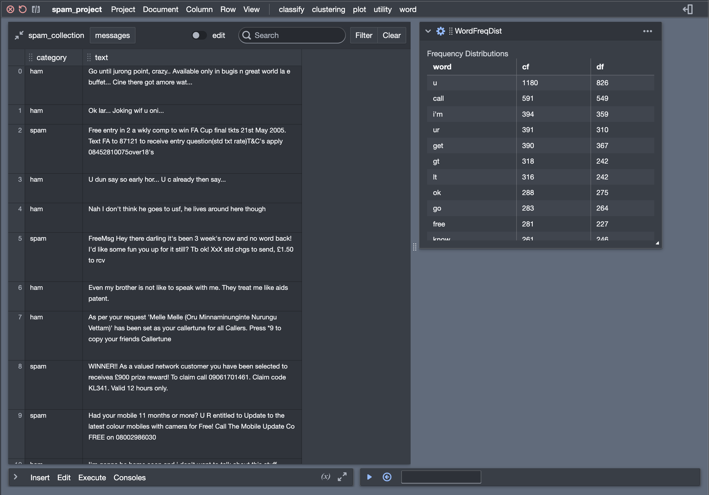
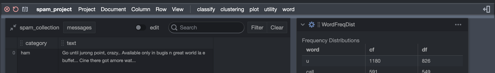
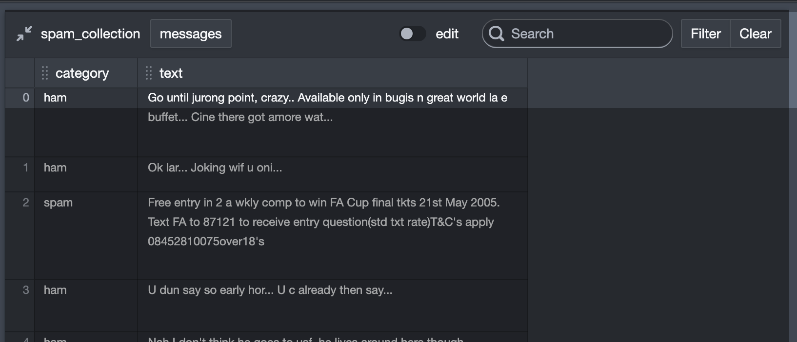
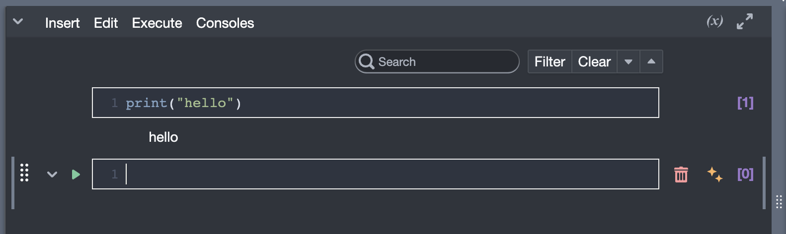
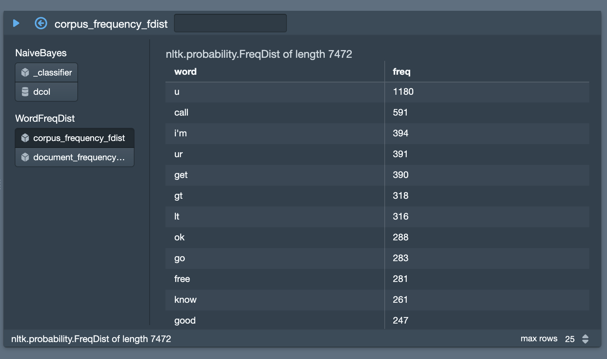

The Main Interface
==================

The helpfully-titled “Main” interface is where you do the real work with
Tactic. It’s what you see when you open a data collection or a project.

The Main Interface menu bar
---------------------------

There is a menu bar at the top.

The two red icons at the far left end of the menu bar close the pane and reload the pane, respectively.
Just to the right of these two icons is a gray icon that can be used to show and hide the main data table.

Just to the right of the left-end icons is the title of the currently-viewed project (in this case "spam_project").

Next there is a set of dropdown menus. Notice that these are separated into two parts by a vertical line. The
dropdown menus to the right of the vertical line are used for creating tile instances in your project. These
menus are generated automatically and will not always be the same. Only tiles that are currently
:doc:`loaded <Which-tiles-are-available-when>` will appear in a menu. Furthermore, when I tile is defined, it
is given a "category," which can be anything that you want. It is these categories that are used to determine
which menus will appear and where each tile will appear in the menus.

To the right of the white bar is a set of fixed menus. The :guilabel:`Document`, :guilabel:`Column`, :guilabel:`Row`,
and :guilabel:`View` menus should be pretty much self-explanatory.

Use the :guilabel:`Project` menu to save the current state of a project. There are two kinds of saves, regular
saves and lite saves. Lite saves don't save any tile attributes that are exported by a tile, and the saves
of notebooks don't include variables.

There are a few other useful things in the :guilabel:`Project` menu. You can export the project collection
as a data collection back to your library. You can also export the notebook as a `presentation or a report. <Reports-and-Presentations.html>`__

Finally, the :guilabel:`Project` menu has an option :guilabel:`change_collection` which lets
you swap out the data collection in the main data table.

Finally, at the very far right of the menu bar is a little icon that shows the Error Drawer.

The Main Data Table
---------------------------

There are some useful buttons at the top of the panel that holds the
table. In the top-left corner is a button that shrinks the entire table
down to a single small icon. This gives you more space to work with
tiles. There’s also a popup for selecting which document will be
visible, and some search buttons.

You can resize and reorder columns. You
can also change the area available for the table to display by clicking
at the right edge of the table. This doesn’t resize the table, it just
hides part of it.

Other stuff you can do with the table: To select a row, click on the row number on the far left.
To edit a cell, first turn on editing with the little switch at the top of the main
table. Then select the cell you want to edit and start typing.

Tiles in the Main Interface
---------------------------

To the right of the main data table, you'll see any tiles that you have added to your project. Interacting with
these tile objects is complicated enough that I'll deal with it on :doc:`its own page <Working-With-Tiles>`.

The Log in brief
----------------

At the bottom of the main interface, on the left, is the log. When a project is first created, this will be collapsed.
To expand it, click on the the little caret at the left.

The top of the log looks like this. Nice, huh!

The log can do many things, and it will get a fuller treatment on its own page (:doc:`Log-And-Notebook`). You can,
for example, send the currently displayed contents of a tile to the log.

.. _exports_viewer:

The Exports Viewer
------------------

At the bottom of the main interface, on the right, is the exports
viewer. (To see it, click on the  :guilabel:`(x)` button at
the top right of the log.) It is possibly the most useful thing in the entire universe. If
you have read about tiles, you’ll recall that tiles can declare that
some of their variables are available for access by other tiles via
pipes. In order to figure out what’s going on in a project, it’s often
helpful to be able to poke around inside these exported variables.
That’s what the exports viewer allows you to do.

The list on the left allows you to select one of the exports to view.
The text box in the heading allows you to further specify how the
variable is evaluated. The little triangle allows you to re-evaluate
the export. The circle with an arrow sends code to the log that grabs
this export.

There's a bonus: The exports viewer will also show any variables
created in the log.

