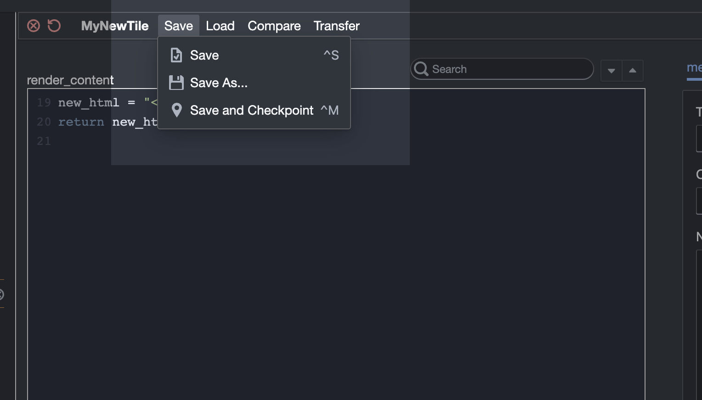
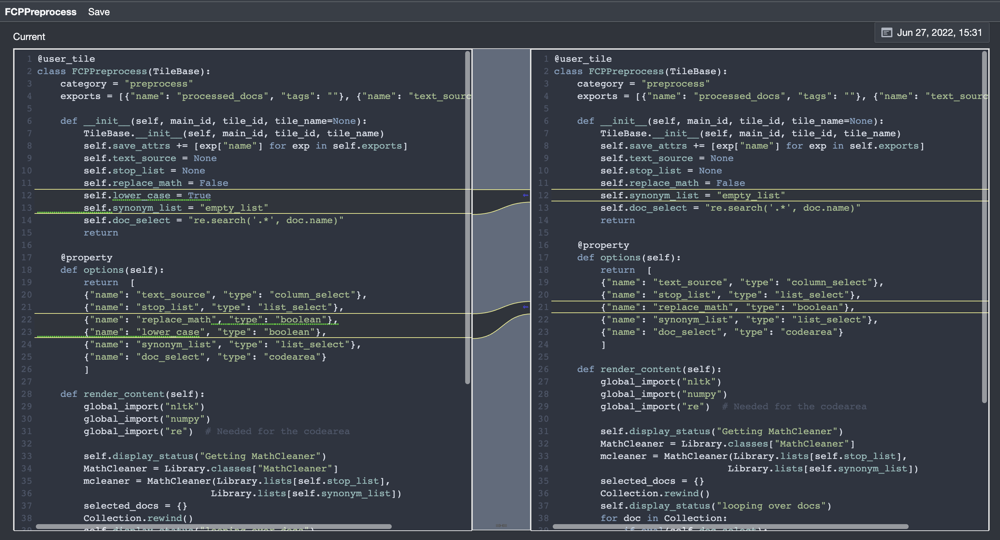
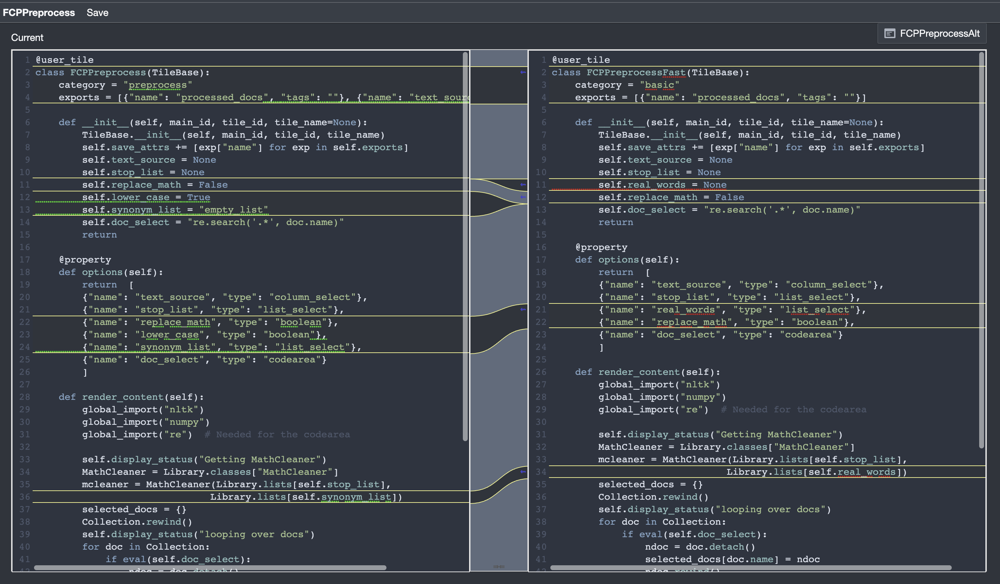

History and Compare
===================

Version History
---------------

There is machinery built into Tactic that helps you to look at and
use code from earlier versions of a tile. This is partly automatic and
partly manual. First the manual part: In the Module Viewer and Tile
Creator select :menuselection:`Save --> Save and Checkpoint` from the menus.
This buttons saves the tile as usual. But it also will cause Tactic to
permanently save a snapshot of the tile code as it appears at the moment
of the save.

Tactic also tries to do some semi-intelligent saving of snapshots
automatically. Every time that a tile is saved, Tactic will save a
snapshot of the tile. However, this set of automatically generated
snapshots is regularly pruned in a particular way: Every time that a
tile is opened in the Module Viewer or the Tile Creator, Tactic looks at
all snapshots that are older than one day ago, and it only keeps the
last version of a tile that was saved on a given day. So you’ll only end
up with at most one snapshot of a tile per day. This pruning doesn’t
affect manually created snapshots.

.. warning::
    I haven't really tested this automated saving and pruning of snapshots, so you shouldn't treat it
    as totally reliable.

You can access the history from the menu :menuselection:`Compare --> View History`.
When the history viewer appears, this is what it looks like, in all it’s glory.

The popup list at the top right allows you to browse through old
versions of the tile. Differences are highlighted and you can copy code
from old versions to the current tile. (You have to click Save for any
changes to be saved. It's the single `Save` menu that appears next to the Tile's name.)

Note that the view you have here shows the tile as it would appear, in its raw form
in the Module Viewer.

.. note::
    If you have any other panes in which you are viewing the tile, you will need to reload those
    panes to get the new version of the tile.

Compare Tiles
-------------

You can also compare two tiles. Clicking on the menu :menuselection:`Compare --> Compare to Other Modules`.
brings up a window that is similar to the history viewer. You can also open the Comparison viewer using
the menus in the Tile Library pane.

The compare viewer looks and operates very similary to the history viewer,
so I won't insult your intelligence by explaining it here. In fact, you probably
could have figured out the history viewer without any documentation. I guess if your
time was all that valuable you wouldn't still be reading this paragraph.
So I don't feel too bad.